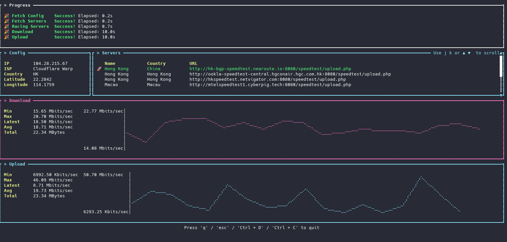

# speedtest-rs

A simple speedtest library and command line tool.

Terminal UI build by [ratatui](https://github.com/ratatui/ratatui/).

Program logic reference [speedtest-cli](https://github.com/sivel/speedtest-cli)

## Demo



## Features

- Download speed test
- Upload speed test
- Http latency test
- Server selection based on latency

## Usage

Basic usage:

```bash
./speedtest-rs
```

## Building from source

```bash
git clone https://github.com/wocaolideTwistzz/speedtest-rs
cd speedtest-rs
cargo build -p speedtest-rs-cli --release
```

## License

This project is licensed under the MIT License - see the LICENSE file for details.
